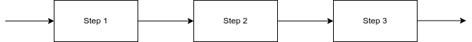

# Template Cookbook


## Responsibility
Software Engineering

## Purpose
This cookbook will serve as a template for future cookbooks and should provide guidance on how to structure, format and name the content of your cookbook.

## Results
By reading these instructions you will be able to create cookbooks yourself. If you follow the guidelines, the cookbook will adhere to the minimum criteria to be accepted as a company cookbook.

## Preconditions
- Knowledge of the Markdown language
- You know what a Cookbook is and what its purpose is

## How to use?
- Sections that are optional will be marked with (o)
- All other sections have to be provided by the creator
- Add a specfic departement to the responsibility section
- Replace the text beneath each section with your own contribution
- Stay concise
- Always provide examples that are tested
- The word Template in the headline must be replaced with the name of what this cookbook is about. Examples: Ansible Cookbook, Spring Boot Cookbook
- If possible, try to explain concepts and workflows with graphs or images.They help to transport complex ideas

```Markdown

```


## Examples
A cookbook should always have examples. In this template we have separated the 'How to use?' section from the 'Examples' section. This is optional and should only demonstrate to the reader of this template that examples are important and necessary for a cookbook. The 'How to use?' section should either refer to examples in this section or should provide minimal examples itself. Therefore this section can be named 'Examples' or 'Additional Examples' or can be integrated in the 'How to use?' section. But examples are mandatory.

Code samples should be provided in a code section

```shell
I am code, please execute me 
```

## Sources (o)
Cite your sources. If you have used code or content of other pages or you reference knowledge from a book, then please provide the original sources. By providing references, you will allow readers to go into more detail about specific topics and also give credit to the original creator.

## Related Topics (o)
If this topic relates to other existing cookbooks, then please add the link here. This will help to interconnect the overall cookbook library and help users to navigate it more efficently.
